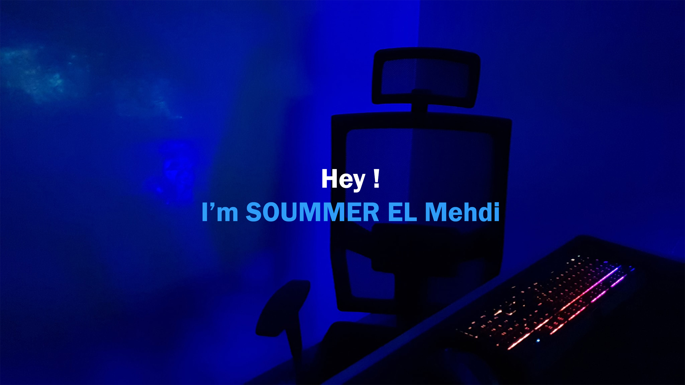

  <samp>
        
     I'm a Data & Software Engineering Student , at <b>INSEA Morocco</b>
      interested in <b>Data Engineering , Big Data , Cloud Computing , Machine learning</b> and new technologies 
     Founder of <b><a rel="nofollow noopener noreferrer" target="_blank" href="https://www.facebook.com/groups/728003797965249">Affectation école d'ingénieur ( Post Prepa ) </a></b> 
     Co Head & Co Founder of Event Cell at <b><a rel="nofollow noopener noreferrer" target="_blank" href="https://www.facebook.com/InseaIE" >INSEA INNOVATION EDGE Club </a></b> 
     
    
    
  <b align="center" width="40px">Goal:  Chill and Improve </b>
</samp>
   
  

- Recent GitHub Activity :

- Find me on 📧 :  
  
  [][Gmail]
  [][Reddit]
  [][linkedin]
  [][Github]
  [][Spotify]

[youtube]: https://youtube.com/codeSTACKr
[Github]: https://github.com/SoummerELMehdi
[linkedin]: https://www.linkedin.com/in/soummermehdi/
[Reddit]: https://www.reddit.com/user/Strif3__
[Gmail]: soummermehdi1611@gmail.com
[Spotify]: https://open.spotify.com/user/26bujl7929zomro4a0klpq3hm
